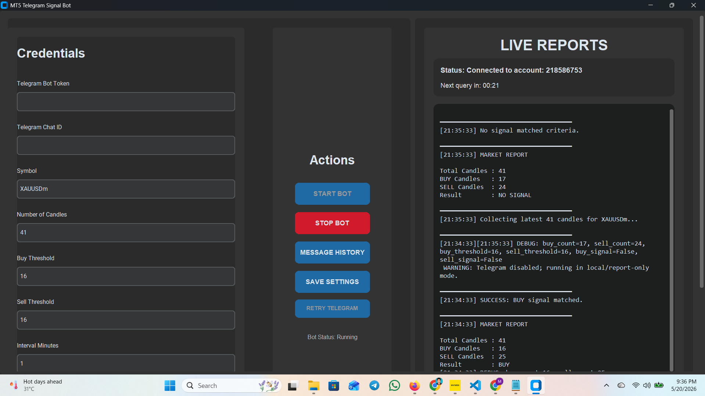
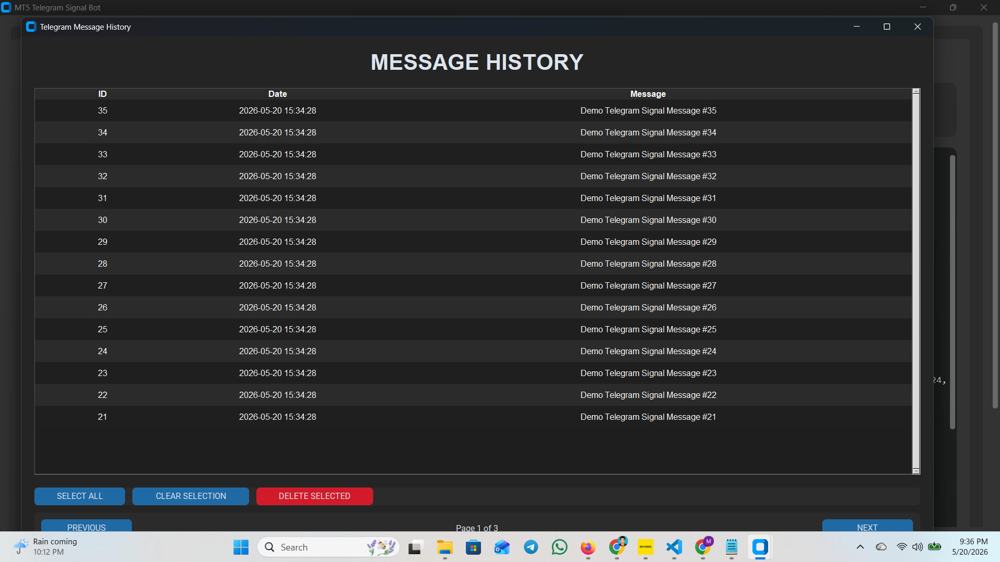

# Exness Meta Trading 5 Signal Bot

You need "Exness MT5" desktop app running and logged in. Then this app will grab the buy-sell candles and send reports to your telegram channel when the threshold is satisfied. This app is written in Python alone and used the sqlite database.

## Built Windows Software

There is already built windows app at main/main.exe, download the "main" named folder in your windows computer and run!

## How To Run

1. Run "pip install -r requirements.txt" to install all the required packages
2. Run "pyinstaller --onedir --windowed --collect-all MetaTrader5 --hidden-import MetaTrader5 main.py" to make the exe file in dist folder
3. "pip uninstall numpy" or "pip uninstall numpy MetaTrader5 customtkinter requests pyinstaller -y" and then "pip install numpy==1.26.4" if necessary

## Home Screen

## Message History

## Contact
For any inquiries, reach out to me at [rajon.kobir@gmail.com](mailto:rajon.kobir@gmail.com).